# Procure Copilot — Architecture

> Companion to [`PROCURE_COPILOT_PLAN.md`](../PROCURE_COPILOT_PLAN.md) (the product/engineering plan) and
> [`README.md`](../README.md) (build/run). This document explains **how the system actually works today**,
> with diagrams, flowcharts and links into the code. Where a capability is only partially built (or
> designed‑for but not built), it is called out with a **TODO / status** note so the architecture stays
> honest.

All money is integer **paise**. Diagrams are [Mermaid](https://mermaid.js.org/) (rendered by GitHub).

## Contents

1. [Frontend & UI architecture (web vs mobile, WebView management, build/deploy)](#1-frontend--ui-architecture)
2. [Per‑platform login — human‑in‑the‑loop](#2-per-platform-login--human-in-the-loop)
3. [Intent classification (prompt → server → LLM → render)](#3-intent-classification)
4. [The RAG / knowledge pipeline (per platform)](#4-the-rag--knowledge-pipeline-per-platform)
5. [Approved‑intent → per‑platform agent execution (plan → JS → WebView → data)](#5-approved-intent--agent-execution)
6. [Comparison flow (collect quotes → optimize → render)](#6-comparison-flow)
7. [Add‑to‑cart flow (navigate‑through to detail page → ADD button → quantity)](#7-add-to-cart-flow)
8. [The final cart / order‑summary page (product + cart links)](#8-final-cart--order-summary-page)
9. [Deployment, observability, eval, debugging, improvement loops](#9-deployment-observability-eval-debugging)

### Platforms at a glance

| Platform | Status | Where |
|---|---|---|
| **Hyperpure** | **Live** (the active platform) | `app/src/core/agents/hyperpure/` |
| **Amazon.in** | Code retained, **disabled by default** (AWS‑WAF bot‑wall) | `app/src/core/agents/amazon/` |
| **Flipkart / others** | **Not built** — designed‑for via the agent seam (TODO) | — |

The active set is the one‑line `ACTIVE_PLATFORMS` in `app/src/core/config.ts` (override `VITE_ACTIVE_PLATFORMS`).

### 10,000‑ft component map

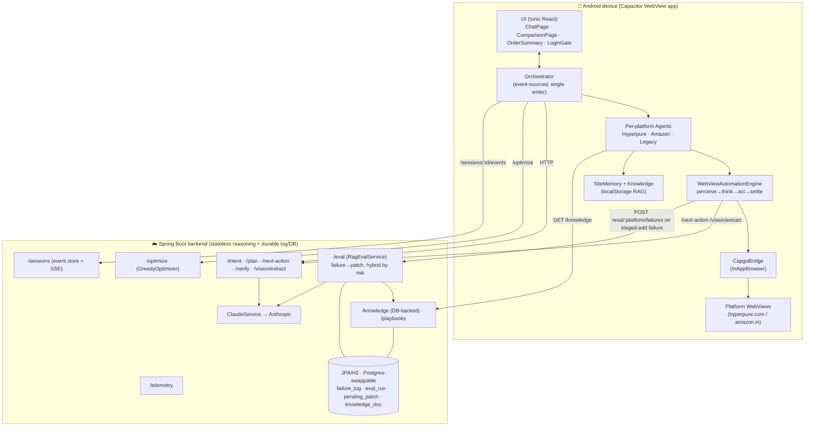

**Core principle (plan §3.6):** the device is **local‑first and event‑sourced**. The WebView + perceive→act
loop must run on the device (that is where the authenticated session and rendered DOM live), so the device
owns live state and renders the UX directly from it; every state change is *also* appended to the backend as
the durable system of record. The backend is a **stateless reasoning provider** (`/plan`, `/next-action`,
`/verify`, `/vision/extract`, `/optimize`) plus a **durable event log** and a small **relational store** (JPA)
for the guided‑RAG self‑improvement loop — the failure log, eval runs, gated patches and versioned knowledge
docs (§4③). No polling on the hot path.

---

## 1. Frontend & UI architecture

### 1.1 Stack & entry

- **Ionic 8 + React 18 + Capacitor 8 + TypeScript + Vite.** Android‑first.
- Entry: `app/src/main.tsx` → `app/src/App.tsx` (routes `/flow` → `ProcureFlow`, `/chat` → `ChatPage`).
- 100% of the logic lives in `app/src` (the web layer). The native `app/android/` Capacitor project is a
  **generated artifact** (produced by `npx cap sync android`) — it is not the source of truth.

### 1.2 What can be tested on the web vs what needs the mobile app

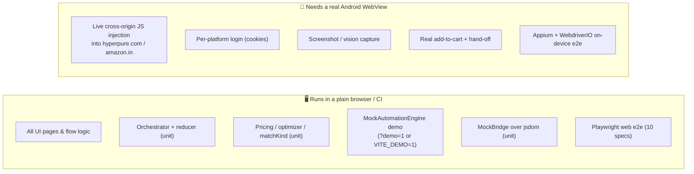

- **Web‑testable:** every page renders and the entire orchestrator/optimizer/pricing/agent‑routing logic
  runs without a device. The **demo seam** (`MockAutomationEngine`, `app/src/core/automation/__mocks__/MockAutomationEngine.ts`)
  swaps **only** the automation transport — orchestrator, checkout driver, Verifier and the live backend
  calls run unchanged — so the full journey is exercised in a browser. `MockBridge`
  (`app/src/core/automation/MockBridge.ts`) runs the *real* injected perceiver/actor against a jsdom
  `Document` for unit tests.
- **Needs the device:** cross‑origin DOM injection into third‑party sites is impossible in a normal browser
  tab (Same‑Origin Policy; Amazon sends `X-Frame-Options: DENY`), so live search/read/add, per‑platform
  login cookies, screenshots and the OTP/payment hand‑off only work in a real Android WebView. These are
  covered by the on‑device Appium suite (`app/e2e-android/`).

### 1.3 Frontend module map (`app/src/core` + `app/src/ui`)

| Module | Path | Responsibility |
|---|---|---|
| Orchestrator | `app/src/core/orchestrator/` | `store.ts` (observable store), `session.ts` (pure event‑sourced reducer), `Orchestrator.ts` (single writer + durable outbox) |
| Backend client | `app/src/core/backend/BackendClient.ts` | Typed Spring Boot client; URL probing; 45 s timeout; `BackendHttpError` |
| Automation engine | `app/src/core/automation/` | `AutomationEngine.ts` (seam), `WebViewAutomationEngine.ts` (loop), `bridge.ts` (Capgo), `MockBridge.ts`, `injected/` |
| Agents | `app/src/core/agents/` | `PlatformAgent.ts`, `AgentRegistry.ts`, `amazon/`, `hyperpure/`, `LegacyAgent.ts` |
| Adapters | `app/src/core/adapters/` | Shared playbooks/selectors, recorded fixtures, `createEngine` factory |
| Pricing | `app/src/core/pricing/` | `packPricing.ts`, `quantityReconcile.ts`, `matchKind.ts` |
| Optimizer | `app/src/core/optimizer/` | `OptimizerClient.ts`, `defaultSelection.ts` |
| Checkout | `app/src/core/checkout/` | `CheckoutDriver.ts`, `VerifierClient.ts`, `idempotency.ts`, `OrderConfirmationParser.ts` |
| Intent | `app/src/core/intent/` | `IntentClient.ts`, `itemListModel.ts`, `scrubForApi.ts`, `speech.ts`, i18n `strings.ts` |
| Knowledge / RAG | `app/src/core/knowledge/` | `PlatformKnowledgeStore.ts`, `siteMemory.ts`, `signature.ts` |
| Domain | `app/src/core/domain/types.ts` | `Quote`, `Allocation`, `PlatformId`, `RequestedItem`, `QuoteRead`… |
| Auth | `app/src/core/auth/loginStore.ts` | Per‑platform "signed‑in" booleans (no credentials) |
| Audit / Secure / Debug | `app/src/core/{audit,secure,debug}/` | Hash‑chained audit log, secret‑store seam, opt‑in trace store |
| UI pages | `app/src/ui/pages/` | `ProcureFlow.tsx`, `ChatPage.tsx`, `ComparisonPage.tsx`, `OtpPaymentPage.tsx`, `OrderSummaryPage.tsx`, `LoginGate.tsx` |
| UI components | `app/src/ui/components/` | `AutomationDebugOverlay.tsx`, `AllocationCard.tsx`, `OrderReceiptCard.tsx`, brand header/logo |

### 1.4 State management — single‑writer, event‑sourced

The orchestrator is the **single writer** of `SessionState`. There is no Redux/MobX; it is a tiny
observable store that the UI binds to via React's `useSyncExternalStore`.

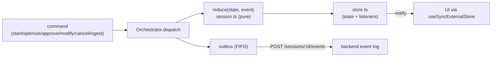

- `app/src/core/orchestrator/session.ts` — `reduce(state, event)` is a pure switch over `OrchestratorEvent`.
  **Safety invariant:** `executing`/`needs_otp`/`needs_payment`/`placing`/`done` are unreachable without an
  `Approved` event; pre‑approval automation events are ignored. `hydrate()` replays a persisted log to rebuild
  live state (cold‑start/resume).
- `app/src/core/orchestrator/Orchestrator.ts` — on every state‑changing event it (1) updates the store →
  instant re‑render, then (2) enqueues the event to a FIFO **outbox** drained with bounded retry+backoff.
  The drain **drops permanent 4xx** (`BackendHttpError.isClientError`) instead of retrying — e.g. a `404`
  because the backend was restarted and no longer has the in‑memory session (telemetry is best‑effort).
- UI subscription points: `ProcureFlow.tsx`, `ComparisonPage.tsx`, `AutomationDebugOverlay.tsx`.

### 1.5 Screen flow (one controller, state‑driven)

`ProcureFlow.tsx` is a single controller that swaps screens based on `state.status` (no deep router nav):

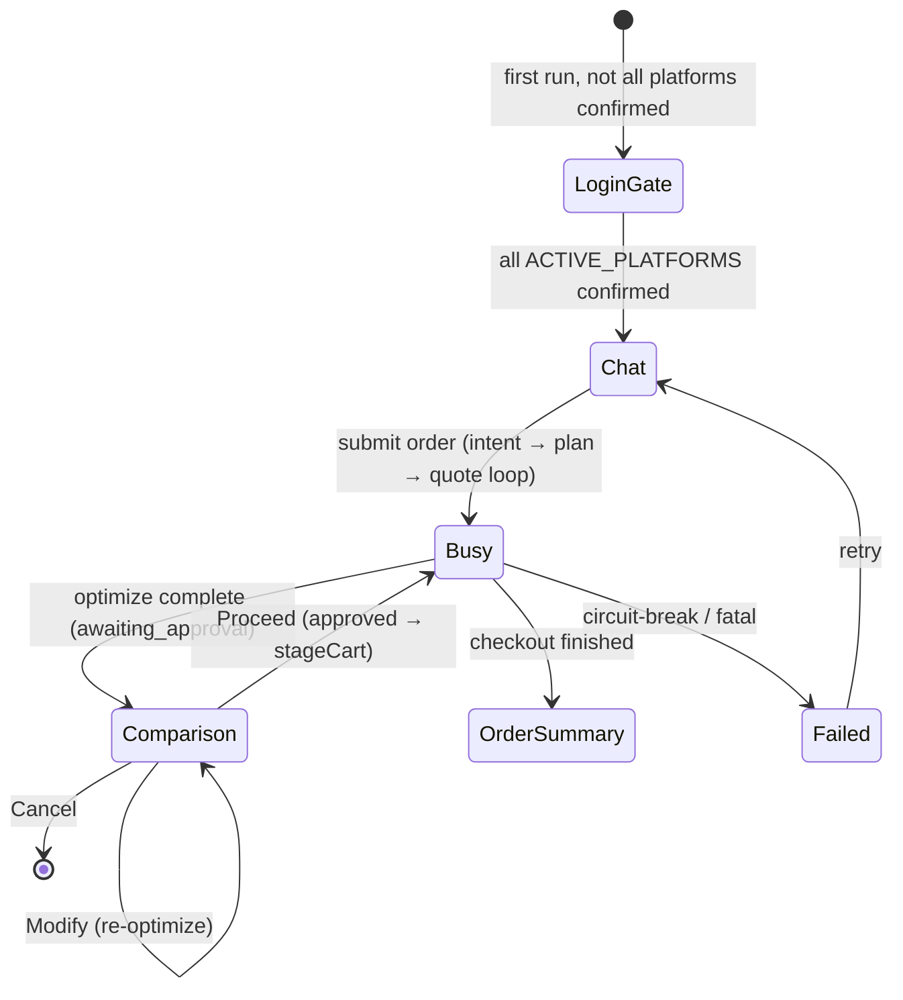

### 1.6 WebView management

`CapgoBridge` (`app/src/core/automation/bridge.ts`) wraps `@capgo/capacitor-inappbrowser`. The
`InAppBrowserBridge` interface is the seam; `MockBridge` is the test double.

- **One webview per platform**, addressed by a logical id (`"hyperpure"`/`"amazon"`) mapped to the plugin's
  id (`idMap`). Cookies persist in the shared Android WebView store, so a login survives across runs and
  across close/reopen.
- **`open()` always opens a fresh webview, closing any existing one for that id first.** This was a
  deliberate fix: reusing a webview via `setUrl` does **not** fire `browserPageLoaded`, so the
  `reinjectPending` safety net (which re‑injects an in‑flight call whose script context a navigation wiped)
  never runs and the settle call strands at its 15 s timeout. Close‑then‑open keeps the load→re‑inject→settle
  handshake reliable *and* avoids the "stacked webviews that never close" bug.
- **Reply transport is the chunked page console.** `window.mobileApp.postMessage` is unreliable on this
  plugin build, so injected scripts emit replies as framed `@@HPB@@<rid>@@<seq>@@<total>@@<json>@@HPE@@`
  console lines, reassembled in `handleBridgeChunk` and correlated to a pending `call()` by `requestId`
  (`AbstractBridge.call`, 15 s timeout, max 4 re‑injects). A boot `injectProbe` exercises both channels.
- **`hidden` mode** runs JS without showing the webview; `show()` reveals it only at HITL (OTP/payment/login)
  moments. `openLoginSession()` opens visibly with a nav toolbar and resolves on the window's `closeEvent`.

Injected scripts (`app/src/core/automation/injected/`), each a pure function wrapped into an injectable IIFE:

| Script | File | Purpose |
|---|---|---|
| Perceiver | `domSerializer.ts` | Walk the DOM (incl. open shadow roots / same‑origin iframes), tag interactable/visible nodes `data-pc-idx`, post compact `{idx,tag,role,name,value,bbox,attrs}` |
| Actor | `actionExecutor.ts` | `click` (resolves to the nearest interactive ancestor, then dispatches the full touch→pointer→mouse→click gesture on the **deepest element at the tap point** so a React handler bound to an *inner child* fires — see §7), `type` (native value setter + input/change), `select`, `scroll` |
| Settle waiter | `settleWaiter.ts` | Resolve on network‑idle + DOM‑quiet debounce (600 ms), hard cap 8 s |
| Bridge emit | `bridgeEmit.ts` | Emit replies over both postMessage and chunked console |

### 1.7 Build & deploy architecture

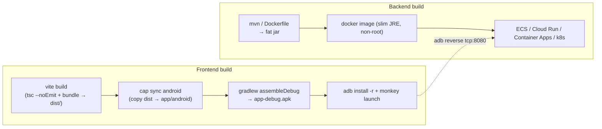

- Scripts in `app/package.json`: `build` (`tsc --noEmit && vite build`), `android:debug`
  (`VITE_DEBUG_AUTOMATION=1` build + sync + `adb reverse` + run), `android:demo:build`
  (`scripts/android-demo-build.sh`, forces `VITE_DEMO=1`/`VITE_DEBUG_AUTOMATION=0`), `test`/`test:e2e`/`test:e2e:android`.
- Reaching a local backend from the device: `adb reverse tcp:8080 tcp:8080` tunnels the device's
  `localhost:8080` to the Mac (most reliable), or the emulator alias `10.0.2.2:8080`, or a cloud HTTPS URL —
  `VITE_BACKEND_URL` (comma‑separated; the client probes and picks the reachable one). See `README.md`.
- Backend is a multi‑stage `backend/Dockerfile` (fat jar on a slim JRE). `docker compose up` for local; any
  container host for cloud, with the Anthropic key injected as a **secret**, health probe `/actuator/health`.
- **TODO:** the on‑device secure store (`SecureStore`) is an in‑memory seam; Keystore/EncryptedSharedPreferences
  (or SQLCipher) wiring is pending. Native STT (`intent/speech.ts`) is a `NoopSpeechInput` stub today.

---

## 2. Per‑platform login — human‑in‑the‑loop

Each platform's login is the user's own manual sign‑in inside that platform's real WebView. We never store
credentials or OTPs — only a **per‑platform boolean** that the user confirmed. Cookies live in the shared
Android WebView store, so once signed in, later runs go straight to search.

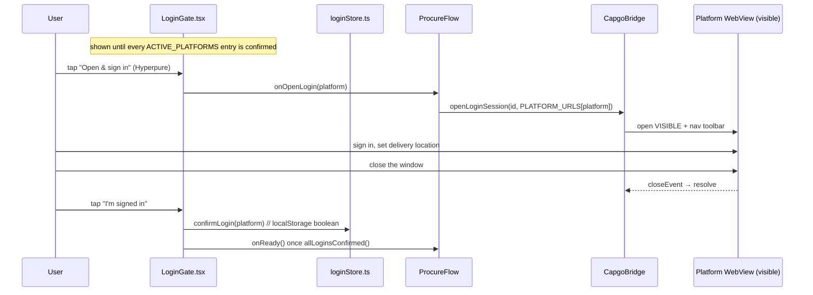

- `app/src/ui/pages/LoginGate.tsx` — first‑run gate; one row per active platform.
- `app/src/core/auth/loginStore.ts` — `isLoginConfirmed` / `confirmLogin` / `resetLogin` /
  `allLoginsConfirmed`, keyed `pc.login.confirmed.<platform>` in `localStorage` (booleans only).
- `app/src/core/automation/bridge.ts` → `openLoginSession()` — visible webview + toolbar, resolves on close.
- **Mid‑run re‑login:** the engine also detects a login wall during automation
  (`WebViewAutomationEngine.detectLoginWall` → `looksLikeLoginWall`); `ProcureFlow` can foreground the
  webview for a hand‑off. Demo mode skips the whole gate.

> Each platform is independent: confirming Hyperpure does not confirm Amazon. Re‑enabling Amazon adds an
> Amazon row to the gate automatically (it iterates `ACTIVE_PLATFORMS`). **Flipkart/others:** TODO — adding a
> platform to `ACTIVE_PLATFORMS` + `PLATFORM_URLS` is all the gate needs.

---

## 3. Intent classification

The retailer types (voice is a stubbed seam) a vernacular order; it is parsed into structured
`RequestedItem`s with `qty/unit/brand/variant/packSize`.

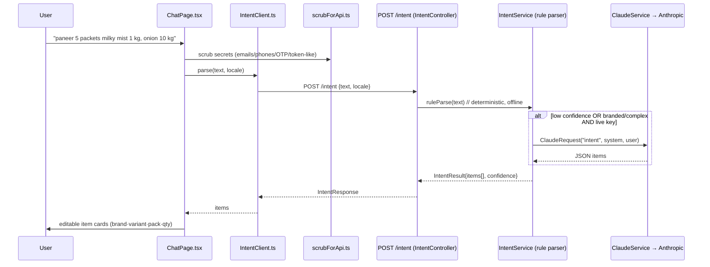

### How it works

- **Frontend** — `app/src/ui/pages/ChatPage.tsx` collects the text, `app/src/core/intent/scrubForApi.ts`
  scrubs secrets on‑device *before* anything leaves, `app/src/core/intent/IntentClient.ts` calls
  `POST /intent`. The parsed items become an editable list (`intent/itemListModel.ts`) shown as cards;
  i18n in `intent/strings.ts` (en/hi/bn).
- **Server** — `IntentController` → `IntentService` (`backend/.../agent/IntentService.java`). A
  **deterministic rule parser** handles vernacular numerals (do/teen/paanch, Bengali/Devanagari digits),
  units (kg/g/l/ml/packet/carton/dozen…), and ~60 item synonyms (aloo→potato, pyaaz→onion). It disambiguates
  glued numbers: a number tied to a **measure** unit (`kg/g/l/ml`) becomes `packSize`; a number tied to a
  **count** unit (packet/dozen) becomes `qty`+`unit`. A **branded** good given only a weight (e.g. "Milky
  Mist paneer 500 g") treats the weight as `packSize` with `qty=1` — while loose produce ("2 kg potato", no
  brand) keeps `qty=2, unit=kg`.
- **LLM routing** — `IntentService.parse` prefers Claude only when a real key is configured (`!claude.isStub()`)
  **and** the order `looksBrandedOrComplex` (any brand/variant/packSize, or a chunk with ≥2 numbers), or as a
  safety net when rule confidence `< 0.5`. In stub mode it never touches the network. The Claude system prompt
  enforces the same "bare weight is packSize, not qty" rule.
- **LLM transport** — `ClaudeService.complete` (`backend/.../llm/ClaudeService.java`) is the single Anthropic
  entry point. It scrubs again (`SecretScrubber`), and in stub mode dispatches to a deterministic
  `ClaudeResponder` per task (`IntentResponder`, etc.) so the whole loop runs offline/CI. Model =
  `ANTHROPIC_MODEL` (default `claude-sonnet-4-6`).
- **Plan normalization** — after intent, `POST /plan` (`PlanService`) merges duplicate `(canonicalItemId, unit)`
  lines (summing qty) while **preserving** brand/variant/packSize, and returns the platforms to query.

---

## 4. The RAG / knowledge pipeline (per platform)

There are **three** layers, all keyed per platform, that make the agents resilient to site differences and
let them learn. Two are on‑device (curated hints + durable site memory) and steer *this* run; the third is a
**closed self‑improvement loop** on the backend that mines device failures into curated‑knowledge patches for
the *next* run. All three are built and wired for Hyperpure.

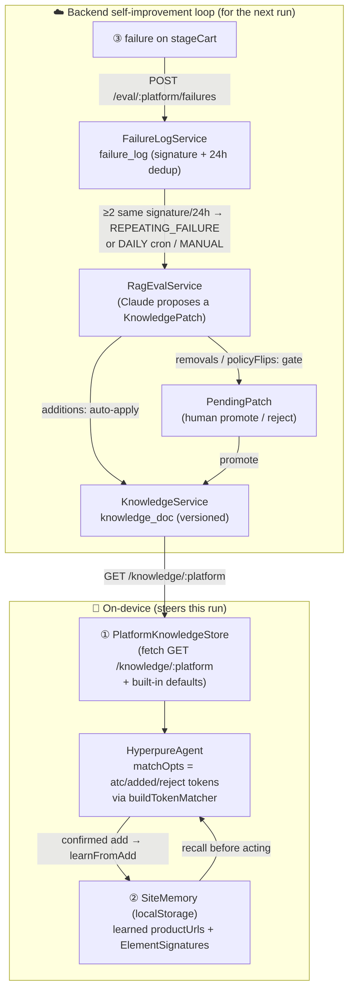

### ① Guided knowledge (curated policies + hints)

- **Backend:** `KnowledgeService` (`backend/.../knowledge/KnowledgeService.java`) is now **DB‑backed**. On
  first boot it seeds any missing platform from `backend/src/main/resources/knowledge/{platform}.json`
  (`hyperpure.json`, `amazon.json`) into the `knowledge_doc` table (`KnowledgeDocEntity`, PK = platform,
  `version`, `doc_json`, `updated_at`); thereafter the live doc is read/written from the DB and its `version`
  bumps on every change. `KnowledgeDoc = {platform, version, policies, hints, notes}`;
  `hints = {rejectTokens, processedVariantTokens, atcTokens, addedTokens, searchNotes}`;
  `policies = {priceFromDetailPage, trustListingPrice}`. Endpoints (`KnowledgeController`): `GET /knowledge`,
  `GET /knowledge/{platform}`, `POST /knowledge/{platform}/observations` (append a `KnowledgeNote`).
- **Frontend:** `PlatformKnowledgeStore` (`app/src/core/knowledge/PlatformKnowledgeStore.ts`) fetches the doc
  (falling back to built‑in `defaults.ts`, and `normalizeKnowledgeDoc` coerces any partial payload so agents
  never see `undefined`), exposes `getKnowledge`/`recordObservation`. Agents fold the hint tokens into their
  matchers via `buildTokenMatcher(base, tokens)` (`app/src/core/knowledge/tokenMatcher.ts`) — it appends the
  curated tokens to a hard‑coded base regex (escaped, case‑insensitive). **Knowledge only widens recognition;
  an absent/empty doc is a no‑op**, so a bad or missing hint can never *break* a flow, only fail to help.

### ② Site memory (durable, learned element signatures + URLs)

- `app/src/core/knowledge/siteMemory.ts` — `SiteMemory` is a `localStorage`‑backed store (`pc.sitemem.<platform>`) of:
  - **product URLs** keyed by canonical item id (`rememberProductUrl`/`recallProductUrl`, with a `hits`
    reinforcement count), and
  - **element locators** keyed by role (`"search:searchBox"`, `"listing:productCard"`, `"detail:addToCart"`)
    as durable `ElementSignature`s with a confidence score (`rememberLocator` reinforces on reuse,
    `penalizeLocator` decays after a miss, max 5 per role).
- `app/src/core/knowledge/signature.ts` — `toSignature(el)` captures `{tag, role, namePattern, attrType,
  hasHref, bbox center, confidence, hits}`; `matchSignature(observation, signatures)` re‑finds a learned
  control by scoring candidates (`scoreSignature`; tag mismatch is a hard 0, name/role/attr/geometry add
  points, `MATCH_THRESHOLD = 4`). A stale signature simply scores too low — a site redesign can never wedge a
  flow onto the wrong element.
- **Wiring:** `SiteMemory` is created per platform in `ProcureFlow` (`memoryFor`, **`undefined` in demo mode**)
  and handed to `HyperpureAgent` via `AgentRegistry`. On a **confirmed** add the agent calls `learnFromAdd`
  (remember the product URL + the ADD/card signatures); on the next run `detailUrlFor` recalls the URL
  (opening the detail page directly, skipping search) and `resolveAddButton` tries the learned ADD locator
  before heuristics.

### ③ Backend self‑improvement loop (failure → eval → hybrid‑by‑risk patch)

This is the closed loop that turns a real on‑device failure into a curated‑knowledge fix — **no app release
and no human in the steady state for the safe changes.**

- **Report (device):** when `CheckoutDriver.stageCart` gets a `{status:"failed"}` from an agent, it calls
  `reportStagingFailure` → `BackendFailureReporter.report` (`app/src/core/knowledge/failureReporter.ts`),
  which `POST`s `/eval/{platform}/failures`. The payload is
  `{flow, signature (=skuId), reason, url, domDigest, screenshotBase64?, itemName, at}`. The **DOM digest** is
  a bounded, human‑readable summary — `digestObservation` (`failureDigest.ts`) emits at most 40 labelled
  elements, names truncated to 48 chars — **never the raw DOM** (token cost + session text). The reporter is
  **rate‑limited on‑device** to ≤1 report per `platform|flow|signature` per hour (persisted in `localStorage`
  `pc.failcooldown`) and is **disabled in demo mode**. It is best‑effort and never throws.
- **Store + dedup (backend):** `FailureLogService` persists each report to the `failure_log` table
  (`FailureLogEntity`), stamping server time. A **signature** groups “the same failure” (explicit signature →
  `skuId` → a slug of `itemName+reason`). A failure is **repeating** when the same `(platform, signature)` has
  occurred **≥2 times in a 24 h window**.
- **Trigger (backend):** `EvalTriggerService` runs `RagEvalService.evaluate` on one of three triggers
  (`EvalTrigger`): **`REPEATING_FAILURE`** (fired by a repeating report, but at most once/hour/platform so a
  storm can't stampede), **`DAILY`** (`@Scheduled` cron `0 0 3 * * *`, sweeps all platforms — needs
  `@EnableScheduling`, present on `ProcureCopilotApplication`), and **`MANUAL`** (`POST /eval/{platform}/run`).
- **Evaluate (backend, Claude):** `RagEvalService` pulls up to 25 **unconsumed** failures, sends the current
  `KnowledgeDoc` + the failure batch (first screenshot attached for vision) to Claude, and asks for the
  *smallest* `KnowledgePatch` = `{summary, additions, removals, policyFlips}`. The batch is marked
  **consumed** so it's never re‑processed. Offline/CI uses a deterministic `RagEvalResponder` stub (no key).
- **Apply — hybrid by risk:**
  - **`additions`** (new `atcTokens`/`addedTokens`/`rejectTokens`/`searchNotes`) only *widen* recognition, so
    they are **auto‑applied**: merged into the doc (case‑insensitive, skip dupes), `version` bumped, saved.
  - **`removals`** and **`policyFlips`** (`priceFromDetailPage`/`trustListingPrice`) can *break* a working
    flow, so they are **gated**: written as a `PendingPatchEntity` (`pending_patch`, status `PENDING`) for a
    human to `promote` (apply + bump version) or `reject`. Every run is recorded immutably in `eval_run`
    (`EvalRunEntity`: trigger, status `SUCCESS|NOOP|ERROR`, from/to version, summary, applied/pending JSON).
- **Consume (device):** the next run's `PlatformKnowledgeStore.getKnowledge` fetches the updated doc, and the
  new `atcTokens`/`addedTokens` flow straight into the agent's `buildTokenMatcher` — closing the loop.

### How to run / operate the RAG loops

**On‑device site memory (②)** learns **inline** on every confirmed add — nothing to run. To force a relearn
after a redesign, clear the platform's `localStorage` (`pc.sitemem.<platform>`) or reinstall, then run an
order: the agent falls back to heuristics/vision, succeeds, and re‑learns the URL/locators.

**Backend eval loop (③)** — the failure log fills automatically as the device hits `stageCart` failures. To
drive/inspect it (base `http://localhost:8080`, `{platform}` = `hyperpure`):

```bash
# Trigger an eval pass now (instead of waiting for a repeat or the 3 AM cron):
curl -X POST http://localhost:8080/eval/hyperpure/run
# Recent eval runs (newest first) — see what was applied vs gated:
curl http://localhost:8080/eval/hyperpure/runs
# Gated (risky) patches awaiting a human verdict:
curl http://localhost:8080/eval/hyperpure/pending
# Promote or reject a gated patch by id:
curl -X POST http://localhost:8080/eval/hyperpure/pending/42/promote
curl -X POST http://localhost:8080/eval/hyperpure/pending/42/reject
# See the current curated doc the device will fetch:
curl http://localhost:8080/knowledge/hyperpure
```

The failure log / eval runs / patches / knowledge docs persist in the backend DB (H2 file by default; see
§9). With `ANTHROPIC_STUB_MODE=true` the eval pass still runs end‑to‑end using the deterministic
`RagEvalResponder`, so you can exercise the whole loop offline. For a **live** eval you need
`ANTHROPIC_API_KEY` + `ANTHROPIC_STUB_MODE=false`.

> **Status:** the guided‑RAG closed loop (report → dedup → eval → hybrid apply → serve) **is built and
> tested** (backend `eval/` package + `knowledge/` persistence; device `failureReporter`/`failureDigest`).
> What remains **TODO** (plan §Epic 7): a *continuous* pipeline that also mines successful screenshots/DOM
> into extraction (today the loop learns from *failures* + advisory `recordObservation` notes), playbook
> drift detection / shadow‑mode promotion, and grounder confidence calibration. Amazon eval is dormant while
> Amazon is disabled.

---

## 5. Approved‑intent → agent execution

Once the plan exists, `ProcureFlow.startProcurement` drives the **pricing loop** (read a quote per item per
platform). Each platform is driven by a **per‑platform agent** over the engine; the engine runs the
perceive→think→act→settle loop in the WebView.

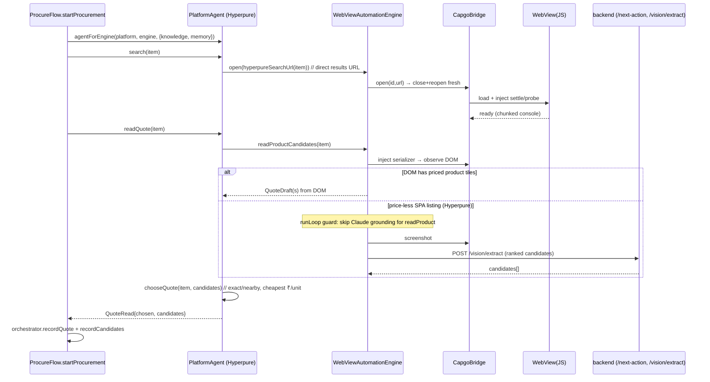

### The agent seam

- `app/src/core/agents/PlatformAgent.ts` — the strategy contract: `ensureReady`, `search`, `readQuote →
  QuoteRead{chosen, candidates}`, `addToCart → AddToCartResult`. `BrowserSession extends AutomationEngine`
  adds raw primitives `observe`/`act`/`captureScreenshot`.
- `app/src/core/agents/AgentRegistry.ts` — `agentForEngine(platform, engine, {hidden, knowledge, memory})`:
  real WebView engines get the dedicated agent (`AmazonAgent`/`HyperpureAgent`); the demo `MockAutomationEngine`
  falls back to `LegacyAgent`. Only Hyperpure receives `SiteMemory`.
- `HyperpureAgent` (`app/src/core/agents/hyperpure/HyperpureAgent.ts`) — `search` navigates **straight to the
  results URL** (`hyperpureSearchUrl`, `/in/search/<slug>?type=SEARCH&query=…`) instead of typing + synthetic
  Enter. `readQuote` reads ranked candidates and picks via `chooseQuote`. Hyperpure does **not** open the
  detail page to read price (tiles carry it).
- `AmazonAgent` (`app/src/core/agents/amazon/AmazonAgent.ts`) — reads the **true detail‑page buybox price**
  (`extractAmazonDetail`) rather than the noisy listing, extracts the ASIN for a canonical `/dp/<ASIN>` URL.

### The perceive→think→act→settle loop

`WebViewAutomationEngine.runLoop` (`app/src/core/automation/WebViewAutomationEngine.ts`):

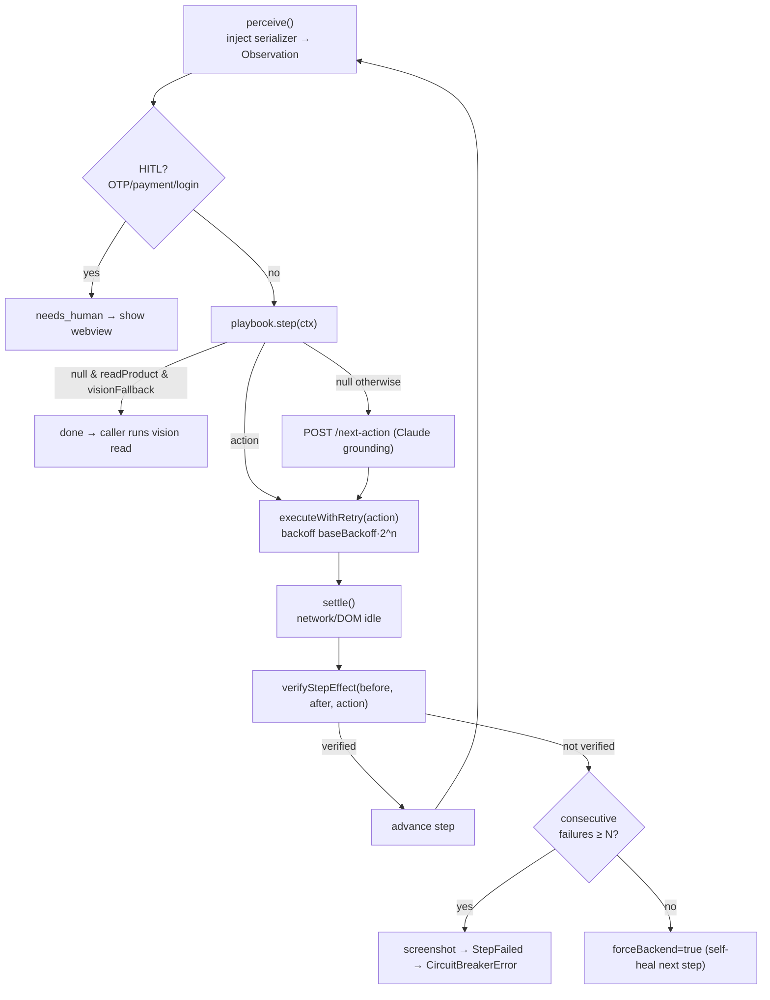

Key behaviors:
- **Playbook‑first, Claude‑grounded fallback.** Deterministic per‑platform `Playbook`s run with zero LLM
  calls; when a step yields no action the engine asks `POST /next-action` (`GroundingService` → Claude
  returns ONE validated `EngineAction`).
- **Vision‑first guard for `readProduct`.** On a price‑less SPA listing (Hyperpure), Claude grounding can't
  read the DOM and tends to navigate home (blanking the screenshot). So when `visionFallback` is on and the
  step is `readProduct`, the loop ends (`{kind:"done"}`) and the caller runs the **vision read** on the
  settled listing instead of burning a grounding call.
- **Read resilience.** `runReadLoopSafe` swallows a tripped circuit breaker (or any loop throw) so the vision
  fallback still gets to run on whatever page is showing — this is what stopped "the 2nd item is never
  sourced".
- **Circuit breaker + self‑heal.** `verifyStepEffect` checks per‑action expectations (typed value present,
  scroll moved, cart badge advanced, URL changed…). Un‑verified steps increment a counter; at
  `maxConsecutiveFailures` it screenshots, emits `StepFailed`, and throws `CircuitBreakerError`.

### Vision read (Set‑of‑Mark fallback)

`visionReadCandidates` shows the webview if hidden, scrolls to top, screenshots, and posts to
`POST /vision/extract`. `VisionExtractService` (`backend/.../agent/VisionExtractService.java`) asks Claude
for up to **5 ranked candidates** `{title, pricePaise, mrpPaise, inStock}`, parsed defensively (drops
title‑less/price‑less, dedupes SKUs). A malformed/empty completion degrades to `notFound()` (never invents a
price). For each candidate the engine resolves a detail URL via `findProductUrlForTitle`.

> A `404` from Anthropic (a retired model id) is caught and logged with a clear hint
> ("model … not found; update `ANTHROPIC_MODEL`"); a boot probe (`AnthropicStartupProbe`) flags an
> unreachable model loudly at startup so this surfaces as config, not as in‑app "nothing found".

### Where data is saved & how the webview closes

Each quote is recorded via `orchestrator.recordQuote` (→ local store + outbox → backend event log) and
`recordCandidates` (for the picker). After all platforms/items, `ProcureFlow` closes the webview, seeds
best‑value pins (`defaultPlatformPins`), and calls `orchestrator.optimize()`.

---

## 6. Comparison flow

After quotes are collected the device seeds **best‑value default pins** and calls the backend optimizer; the
result renders as an explainable rupee split.

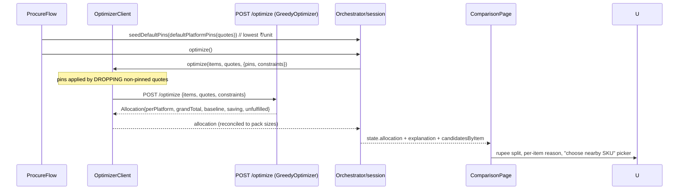

### How quotes are collected & compared

- **Pack normalization** (`app/src/core/pricing/packPricing.ts`) — parses pack size from the title
  ("1 Kg", "500 g", "pack of 6", multipacks) and computes a single comparable number `comparableUnitPaise`
  (₹/kg, ₹/L, or ₹/piece). This is the cross‑platform apples‑to‑apples ranking key.
- **Match quality** (`app/src/core/pricing/matchKind.ts`) — `matchKind(item, quote)` = `"exact"` when both
  brand **and** size match, else `"nearby"`. `chooseQuote` sorts in‑stock first, exact‑before‑nearby, then
  lowest ₹/unit — this is the per‑item default pick.
- **Default pins** (`app/src/core/optimizer/defaultSelection.ts`) — pre‑pin each item to the lowest ₹/unit
  platform so a 1 kg pack isn't beaten by a cheaper‑*looking* 500 g pack. `OptimizerClient.buildRequest`
  applies a pin by **dropping** the other platforms' quotes for that item.

### The optimizer (where the value is)

`GreedyOptimizer` (`backend/.../optimizer/GreedyOptimizer.java`, `POST /optimize`) — pure, deterministic,
integer‑paise:
1. Assign each item to its cheapest in‑stock platform; split the remainder to the next cheapest when a stock
   cap is hit; unmet demand → `Unfulfilled`.
2. For a platform below its **MOV**, pick the cheaper of topping up vs rerouting its items to the other
   platform (avoid a 2nd delivery fee).
3. Respect credit caps (`payableOnCredit`).
4. Emit a rupee **P&L vs the cheapest single‑platform baseline** with a plain‑language reason per line.

> **AI in comparison:** the *allocation* is deterministic (not an LLM) for auditability. The LLM's role is
> upstream — intent extraction, the vision price read, and the optional `/verify` cart‑vs‑plan narration. The
> rupee explanation is generated by `OptimizerClient.explainAllocation`.

### Rendering + the nearby‑SKU picker

`app/src/ui/pages/ComparisonPage.tsx` renders `AllocationCard`s (per‑item reason, per‑platform totals, grand
total, saving). It groups `state.quotes` by item for a per‑platform chooser ("BEST VALUE" badge, "buy N ×
packSize" from `packsNeeded`). When the default pick is a **`nearby`** match it shows `renderNearbyPicker`
from `state.candidatesByItem[item]`; choosing an alternate dispatches `modify({kind:"select-sku", …})`, which
the reducer applies by replacing the chosen quote + pinning the platform, then re‑optimizes. Proceed → `approve()`.

---

## 7. Add‑to‑cart flow

On approval, `ProcureFlow.runCheckout` builds a `productUrls` map (`canonicalItemId → quote.productUrl`) and
runs `CheckoutDriver.stageCart` per platform — a **best‑effort cart hand‑off** (no auto‑place). Each line is
added by the platform agent, which prefers the product's **own detail page** (one unambiguous ADD) over the
crowded search listing.

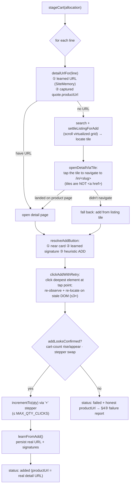

### How the detail page is reached & cached (navigate‑through)

`HyperpureAgent.detailUrlFor` resolves a **known** detail URL in priority order: (1) the **learned URL** from
`SiteMemory.recallProductUrl(canonicalId)`, then (2) the **captured** `quote.productUrl`. It deliberately
**does not guess a slug** — a guessed `/in/<skuId>` used to 404 / bounce to an "explore more" page whose ADD
silently no‑op'd.

When there's no known URL, the agent can't scrape one from the listing either: **Hyperpure search tiles are
not `<a href>` links** — they route via JS and the real slug lives only in React state (there is no
`data-slug` / slug‑in‑image to serialize). So `openDetailViaTile` **taps the matched tile** to navigate to the
product's own page (`/in/<slug>?source=SEARCH_ALL`), reads the resulting URL, and adds there. If the tap
doesn't land on a product page it falls back to adding straight from the listing tile (which also works). On a
confirmed add, `learnFromAdd` persists the **real** URL + the ADD/card `ElementSignature`s, so the next order
opens the detail page directly (when `SiteMemory` is wired — i.e. non‑demo).

### How the ADD button is identified & clicked (the root‑cause fix)

`resolveAddButton` picks the control in order: `findAddButtonForCard` (nearest by Manhattan distance to the
located card — avoids adding a neighbour SKU) → learned signature
(`matchSignature(obs, recallLocators("detail:addToCart"))`) → heuristic `findHyperpureAddButtons[0]`, with
`atcTokens` from curated knowledge widening the label match.

The click is the **robust click** in `injected/actionExecutor.ts`. Hyperpure binds ADD's `onClick` to an
**inner `<span>` that is a child of the `<button>`**, not the button itself. React's delegated event system
only fires that handler when the event target is the span or a descendant — a gesture dispatched on the
ancestor button bubbles *up* and never reaches it, which was the silent "ADD clicked, cart unchanged,
DOM byte‑identical" no‑op on **both** the listing and the detail page. The fix: after resolving the
interactive ancestor (for scroll/focus), dispatch the full touch→pointer→mouse→click gesture on the
**deepest element at the tap point** (`document.elementFromPoint`, with a deepest‑leaf fallback for
jsdom) — exactly what a real finger hits — so the event bubbles *up through* the handler span. Verified live:
a plain `button.click()` does nothing, but dispatching on the inner span swaps ADD → a quantity stepper and
the header cart badge goes 0→1.

`clickAddWithRetry` then confirms with `addLooksConfirmed` and **retries up to 3×**, re‑observing and
re‑locating the ADD on the fresh DOM each time (Hyperpure's React‑hydration re‑render, error #418, can wipe
the `data-pc-idx` handle a click was aimed at). Confirmation (`selectors.ts` `addLooksConfirmed`) accepts a
**cart‑count rise or appearance** — `readCartCount` reads the integer badge that sits *beside* the cart icon
(Hyperpure renders the count as a **sibling** of ``, not inside a cart‑labelled node) —
**or** an `−  qty  +` stepper appearing where ADD was. A failed confirmation returns `status:"failed"` with an
honest product/search URL (never a bouncing slug) and feeds the §4③ failure loop.

### How quantity is handled

The requested demand is reconciled to the platform's **sold pack size** (`pricing/quantityReconcile.ts`,
`reconciledPackCount = ceil(requestedTotal / soldPack)`) — e.g. "10 kg onion" → 1× a 10 kg SKU (not 10×),
50× a 200 g SKU, etc., and works for loose vs branded packaged goods and litres/ml. After a confirmed add,
`incrementTo` clicks the stepper `+` up to `qty − 1` times (capped at `MAX_QTY_CLICKS = 30`), stopping
gracefully if no stepper appears.

> Amazon's `addToCart` (when enabled) requires a `productUrl`, opens it, finds the ATC button via knowledge
> token hints, clicks, and confirms via an "added" matcher — only a confirmed add returns `"added"`.

---

## 8. Final cart / order‑summary page

`stageCart` returns an `OrderAttempt{status:"cart_filled", cartUrl, stagedLines[]}` per platform. The flow
collects these, closes the webviews, and lands on the order summary.

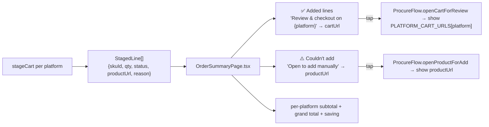

- **Cart links** come from `PLATFORM_CART_URLS[platform]` (`app/src/core/config.ts`);
  `ProcureFlow.openCartForReview` foregrounds the platform's real cart page so the user reviews and checks out
  themselves (OTP/payment always human).
- **Product‑detail links** come from each staged line's `productUrl` (the agent's `AddToCartResult` — for a
  failed add this is an honest **search URL**, never a known‑bouncing slug); `ProcureFlow.openProductForAdd`
  foregrounds it so the user can add that one line manually.
- Totals/receipts: `OrderSummaryPage.tsx` + `OrderReceiptCard.tsx`; staging emits no `OrderPlaced`
  (`orchestrator.finishCheckout()` ends the run).

> **Full auto‑place exists but is not the default.** `CheckoutDriver.run` (Verifier → checkout → OTP/payment
> HITL → idempotent `placeOrder`) is implemented and tested, but `ProcureFlow` runs `stageCart` (cart
> hand‑off) per the product decision. `VerifierClient` (`assertCartMatches`) and `idempotency.ts` (a
> deterministic key prevents double‑orders) gate that path.

---

## 9. Deployment, observability, eval, debugging

### Deployment

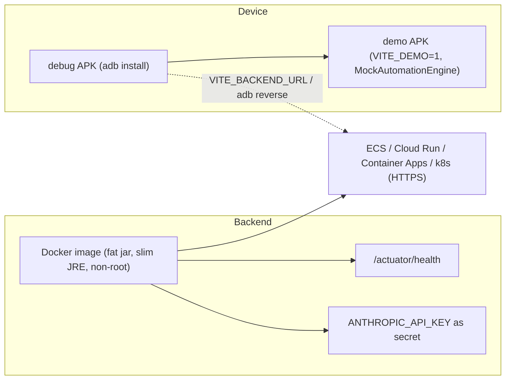

- Backend: `backend/Dockerfile` → any container host; key as a secret; readiness on `/actuator/health`. The
  `AnthropicStartupProbe` logs `model reachable ✓` (or a loud banner) at boot.
- **Persistence:** Spring Data JPA. Default is an **H2 file DB** at `jdbc:h2:file:./data/procure;AUTO_SERVER=TRUE`
  (`SPRING_DATASOURCE_URL`), `ddl-auto: update`, so the failure log / eval runs / gated patches / knowledge
  docs survive restarts. Swap to **Postgres** for production by pointing `SPRING_DATASOURCE_URL` at it (the
  `postgresql` driver is already on the classpath). Sessions/telemetry remain in‑memory today.
- App: production points `VITE_BACKEND_URL` at an HTTPS backend; dev uses `adb reverse`/`10.0.2.2`. Demo APK
  needs no live sites or backend key (stub mode).

### Observability

| Surface | Where | What |
|---|---|---|
| On‑device live trace | `app/src/core/debug/automationDebug.ts` + `ui/components/AutomationDebugOverlay.tsx` | `VITE_DEBUG_AUTOMATION=1`: overlay + `adb logcat` stream of `perceive→plan→act→verify`, agent steps, **every backend & Claude/vision call** (timing + summary), injected `[hpinj]` diagnostics; 2000‑entry buffer, copy‑all |
| Backend step traces | `backend/.../telemetry/` (`/telemetry/recent`) | Per‑step `TraceSpan`s |
| Audit (tamper‑evident) | `app/src/core/audit/AuditLog.ts` + `/telemetry/audit` | Hash‑chained on‑device audit of every checkout step |
| Durable session log | `backend/.../session/SessionStore.java` (`/sessions/{id}`, `/sessions/{id}/stream` SSE) | Append‑only event log, idempotent by `clientEventId`, SSE for a live second screen |
| Failure log + eval history | `backend/.../eval/` (`/eval/{platform}/failures`, `/runs`, `/pending`) | JPA tables `failure_log` / `eval_run` / `pending_patch`; every eval pass and gated patch is auditable (§4③) |

### Debugging guardrails (added after real‑run regressions)

- **Self‑explanatory LLM errors** — `ClaudeService` maps `404`→"model not found; update `ANTHROPIC_MODEL`",
  `401/403`→key, `429`→quota, instead of a bare reactor stack. `AnthropicStartupProbe` probes the model at boot.
- **No 4xx retry storms** — `BackendHttpError.isClientError` lets the orchestrator outbox drop a permanent
  `404` (e.g. a session lost to a backend restart) instead of retrying it N times.
- **Reliable webview lifecycle** — `bridge.open()` close‑then‑reopen (see §1.6) fixes both "stacked webviews"
  and the stranded‑settle 15 s timeout.
- **Honest hand‑off URLs** — a failed add returns a working search URL, never a bouncing slug.

### Eval & continuous improvement — status

| Capability | Status | Notes |
|---|---|---|
| Unit tests (Vitest + jsdom; JUnit + MockMvc) | ✅ | `app` core + `backend`; run `npm test` / `mvn test` |
| Web e2e (Playwright, demo + stub) | ✅ | `npm run test:e2e` |
| On‑device e2e (Appium + WebdriverIO, demo APK) | ✅ | `app/e2e-android/` (full‑journey, split, modify, OTP, payment, cancel, chat…) |
| Recorded site fixtures | ✅ (partial) | `app/src/core/adapters/recordedFixtures/` |
| Step‑level traces + audit | ✅ | overlay + backend telemetry + hash‑chained audit |
| **Guided‑RAG self‑improvement loop** (failure → eval → hybrid‑by‑risk patch → serve) | ✅ | backend `eval/` + DB‑backed `knowledge/`; device `failureReporter`/`failureDigest` (§4③); 121 backend tests incl. `RagEvalServiceTest`/`EvalTriggerServiceTest`/`EvalControllerTest` |
| Durable persistence (failure log / eval runs / patches / knowledge docs) | ✅ | JPA + H2 file (Postgres‑swappable) |
| Continuous RAG learning from **successes** (mine screenshots/DOM into extraction) | ⛔ **TODO** | loop learns from failures + advisory notes today (§4) |
| Golden‑path replayable eval harness | ⛔ **TODO** | plan §Epic 7 |
| Playbook drift detection / shadow‑mode promotion | ⛔ **TODO** | plan §3.5.7 |
| Grounder confidence calibration | ⛔ **TODO** | |
| CP‑SAT optimizer | ⛔ **TODO** | greedy ships; same `optimize()` seam |
| Re‑enable Amazon (solve AWS‑WAF) | ⛔ **TODO** | agent retained; flip `ACTIVE_PLATFORMS` |

---

## Appendix — backend HTTP surface

| Method & path | Controller | Purpose |
|---|---|---|
| `POST /intent` | `IntentController` | Parse order text → structured items + confidence |
| `POST /plan` | `PlanController` | Normalize/merge items, return platforms |
| `POST /next-action` | `NextActionController` → `GroundingService` | One validated `EngineAction` from a scrubbed observation |
| `POST /vision/extract` | `VisionExtractController` | Ranked product candidates from a screenshot |
| `POST /optimize` | `OptimizerController` → `GreedyOptimizer` | Explainable cart‑split allocation |
| `POST /verify` | `VerifyController` | Cart‑vs‑plan assertion (Verifier) |
| `GET /knowledge` · `GET /knowledge/{platform}` · `POST /knowledge/{platform}/observations` | `KnowledgeController` → `KnowledgeService` (DB‑backed) | Guided‑RAG policies/hints (versioned `knowledge_doc`) + append observation |
| `POST /eval/{platform}/failures` | `EvalController` → `EvalTriggerService` | Ingest a device failure report (may trigger a `REPEATING_FAILURE` eval) |
| `POST /eval/{platform}/run` · `GET /eval/{platform}/runs` | `EvalController` → `RagEvalService` | Manually run an eval pass · list recent eval runs |
| `GET /eval/{platform}/pending` · `POST /eval/{platform}/pending/{id}/{promote\|reject}` | `EvalController` | List gated (risky) patches · promote/reject one |
| `GET /playbooks/{platform}` · `GET /playbooks/{platform}/{flow}` · `POST /playbooks/{platform}` | `PlaybookController` | Playbook registry (remote selector fixes) |
| `POST /sessions` · `POST /sessions/{id}/events` · `GET /sessions/{id}` · `GET /sessions/{id}/stream` | `SessionController` → `SessionStore` | Durable event log + SSE |
| `GET /telemetry/recent` · `GET /telemetry/audit` | `TelemetryController` | Step traces + audit events |
| `GET /actuator/health` | Spring Actuator | Liveness/readiness |

LLM access for all of the above funnels through `ClaudeService` (`backend/.../llm/ClaudeService.java`); in
stub mode each task has a deterministic `ClaudeResponder` so the whole system runs offline/CI.
